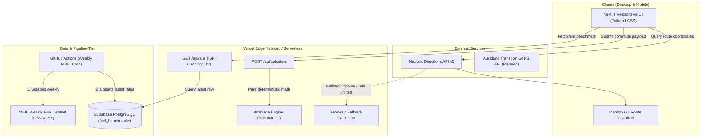
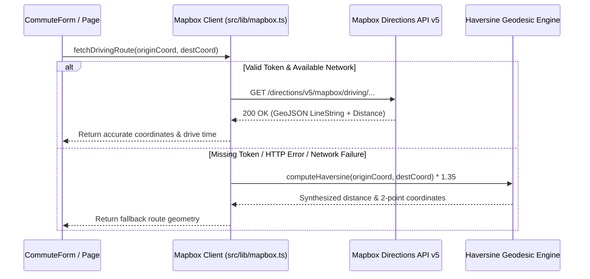

# System Design & Architecture Specification

## 1. System Architecture Diagram

```text
                          ┌─────────────────────────────┐
                          │   MBIE Data.govt.nz Feed    │
                          │   (Weekly Fuel Retail CSV)  │
                          └──────────────┬──────────────┘
                                         │
                                         ▼ (Weekly Cron: Sat 02:00 UTC)
                          ┌─────────────────────────────┐
                          │   GitHub Actions Runner     │
                          │   (scripts/fetch-mbie-fuel) │
                          └──────────────┬──────────────┘
                                         │
                                          (Service Role Upsert)
                          ┌─────────────────────────────┐
                          │     Supabase PostgreSQL     │
                          │   (fuel_benchmarks table)   │
                          └──────────────┬──────────────┘
                                         │
 ┌──────────────────────┐                │ (Public Read / Fallback)
 │ Mapbox Directions    │                ▼
 │ API (Vector Routing) │◄───────┐ ┌───────────────┐
 └──────────┬───────────┘        │ │ Next.js Server │
            │                    ├─┤ Route Handlers│
            ▼                    │ │ (/api/fuel,   │
 ┌──────────────────────┐        │ │  /api/calc)   │
 │   Client Browser     │◄───────┘ └───────────────┘
 │   (React / Next.js)  │
 │   - CommuteForm      │
 │   - ComparisonCard   │
 │   - RouteMap         │
 │   - SavingsChart     │
 └──────────────────────┘
```

Kiwi Commuter is a full-stack, edge-cached web application architected to compare the total financial cost of personal vehicle ownership and commuting against Auckland Transport (AT) public transit in real time.

The system is designed around zero-infrastructure operating costs (utilizing generous free tiers on Vercel, Supabase, and Mapbox) while maintaining high availability through aggressive caching and multi-layer deterministic fallbacks.



---

## 2. Component Architecture

### 2.1 Next.js App Router (Frontend & API)
- **Framework:** Next.js 14 (React 18, TypeScript strict mode).
- **Styling & Layout:** Tailwind CSS with mobile-first safe-area bounds (`viewportFit: 'cover'`, `safe-pb`). On desktop, renders as two independent vertical flex columns (left: CommuteForm + FuelRadarWidget; right: ComparisonCard + RouteMap + MonthlySavingsChart) to eliminate cross-row vertical voids. On mobile, CSS `display: contents` allows seamless single-column flex ordering.
- **State Management & URL Synchronization:** Reactive client-side state in [`src/components/DashboardClient.tsx`](file:///Users/niccasayuran/agy_projects/nz_transport_cost_dashboard/src/components/DashboardClient.tsx) with bidirectional URL search parameter synchronization via [`src/lib/urlParams.ts`](file:///Users/niccasayuran/agy_projects/nz_transport_cost_dashboard/src/lib/urlParams.ts). Commute states hydrate on load from query strings, update via non-reloading `window.history.replaceState`, and support one-click share link clipboard copying with toast confirmation.
- **Route Visualization:** [`src/components/RouteMap.tsx`](file:///Users/niccasayuran/agy_projects/nz_transport_cost_dashboard/src/components/RouteMap.tsx) interfacing with Mapbox GL JS with cooperative gestures enabled and compact above-the-fold sizing.

### 2.2 Mathematical Engine (`src/lib/calculator.ts`)
A zero-dependency, pure calculation module that calculates statutory, energetic, and concession formulas deterministically. It executes both on the server inside API routes and directly in client modules.

---

## 3. Data Pipelines & Fuel Benchmark Ingestion

### 3.1 MBIE Weekly Fuel Price Scraper
- **Source:** Ministry of Business, Innovation and Employment (MBIE) Weekly Fuel Price Monitoring dataset.
- **Script:** [`scripts/fetch-mbie-fuel.ts`](file:///Users/niccasayuran/agy_projects/nz_transport_cost_dashboard/scripts/fetch-mbie-fuel.ts).
- **Execution:** Automated via GitHub Actions workflow [`.github/workflows/fetch-mbie-fuel.yml`](file:///Users/niccasayuran/agy_projects/nz_transport_cost_dashboard/.github/workflows/fetch-mbie-fuel.yml).
- **Frequency:** Every Friday at 22:00 NZST (10:00 UTC) matching MBIE's weekly release cycle.
- **Upsert Strategy:** Idempotent `UPSERT` on conflict over `week_ending_date`.

```typescript
// Script logic flow
const csvData = await downloadMbieCsv(MBIE_DATASET_URL);
const parsedPrices = parseLatestRetailWeek(csvData);

await supabase
  .from('fuel_benchmarks')
  .upsert({
    week_ending_date: parsedPrices.weekEndingDate,
    regular_91: parsedPrices.regular91,
    premium_95: parsedPrices.premium95,
    diesel: parsedPrices.diesel,
    is_provisional: parsedPrices.isProvisional,
    created_at: new Date().toISOString()
  }, { onConflict: 'week_ending_date' });
```

---

## 4. Database Schema & Security (Supabase PostgreSQL)

### 4.1 Schema Definition
Stored under [`supabase/migrations/20260925_init_schema.sql`](file:///Users/niccasayuran/agy_projects/nz_transport_cost_dashboard/supabase/migrations/20260925_init_schema.sql).

```sql
-- 1. Fuel price snapshots table
CREATE TABLE IF NOT EXISTS fuel_benchmarks (
  id UUID PRIMARY KEY DEFAULT gen_random_uuid(),
  week_ending_date DATE NOT NULL UNIQUE,
  regular_91 NUMERIC(6, 2) NOT NULL, -- Retail price in cents/L (e.g. 268.50)
  premium_95 NUMERIC(6, 2) NOT NULL,
  diesel NUMERIC(6, 2) NOT NULL,
  is_provisional BOOLEAN DEFAULT false,
  created_at TIMESTAMPTZ DEFAULT now()
);

-- Index for descending date queries
CREATE INDEX IF NOT EXISTS idx_fuel_benchmarks_date ON fuel_benchmarks (week_ending_date DESC);
```

### 4.2 Row Level Security (RLS) Policies
- **Public Read (`anon`, `authenticated`):** Read-only access to select records.
  ```sql
  ALTER TABLE fuel_benchmarks ENABLE ROW LEVEL SECURITY;
  
  CREATE POLICY "Allow public read access to fuel benchmarks"
    ON fuel_benchmarks FOR SELECT TO anon, authenticated USING (true);
  ```
- **Service Role Access (`service_role`):** Unrestricted insert/update permissions for GitHub Actions worker.
  ```sql
  CREATE POLICY "Allow service role full access to fuel benchmarks"
    ON fuel_benchmarks FOR ALL TO service_role USING (true) WITH CHECK (true);
  ```

---

## 5. Mathematical Modeling & Arbitrage Formulas

All calculations conform to official 2026 statutory rates and Waka Kotahi NZTA legislation.

### 5.1 Distance & Duration
$$\text{Daily Return Distance } (D_{\text{day}}) = 2 \times D_{\text{corridor}}$$
$$\text{Weekly Driving Distance } (D_{\text{wk}}) = D_{\text{day}} \times N_{\text{days}}$$
$$\text{Monthly Driving Distance } (D_{\text{mo}}) = D_{\text{wk}} \times 4.33$$
$$\text{Annual Driving Distance } (D_{\text{yr}}) = D_{\text{wk}} \times 52$$

### 5.2 Direct Driving Costs

#### 1. Energy & Fuel
- **Internal Combustion Engine (ICE - Petrol 91, Petrol 95, Diesel):**
  $$C_{\text{fuel}} = \left(\frac{D_{\text{day}}}{100}\right) \times \text{Consumption (L/100km)} \times P_{\text{fuel}} (\$/\text{L})$$
- **Battery Electric Vehicle (BEV):**
  $$C_{\text{energy}} = \left(\frac{D_{\text{day}}}{100}\right) \times \text{Efficiency (kWh/100km)} \times P_{\text{power}} (\$/\text{kWh})$$
- **Plug-in Hybrid (PHEV):**
  Assumes 65% electric drive share ($S_{\text{EV}} = 0.65$) and 35% ICE drive share ($S_{\text{ICE}} = 0.35$):
  $$C_{\text{PHEV}} = (S_{\text{EV}} \cdot C_{\text{energy}}) + (S_{\text{ICE}} \cdot C_{\text{fuel}})$$

#### 2. Road User Charges (NZTA RUC 2026 Mandate)
- **Petrol Vehicles:** $\$0.000 / \text{km}$ (RUC collected via fuel excise duty).
- **BEV (Light Electric):** $\$0.076 / \text{km}$ ($\$76 \text{ per } 1,000 \text{ km}$).
- **Diesel Vehicles:** $\$0.076 / \text{km}$ ($\$76 \text{ per } 1,000 \text{ km}$).
- **PHEV (Light Plug-in Hybrid):** $\$0.038 / \text{km}$ ($\$38 \text{ per } 1,000 \text{ km}$).

$$\text{Daily RUC} = D_{\text{day}} \times R_{\text{powertrain}}$$

#### 3. Parking & Wear
- **Parking:** Applied per in-office commute day ($P_{\text{daily}}$).
- **Wear & Maintenance (Optional AA Benchmark):** $\$0.18 / \text{km}$ depreciation, tires, servicing.
- **Carpool Allocation:**
  $$\text{Total Daily Driving Cost} = \frac{C_{\text{fuel/energy}} + \text{RUC} + P_{\text{daily}} + C_{\text{wear}}}{\text{Carpool Passengers}}$$

---

### 5.3 Auckland Transport Public Transit Costs

#### 1. Zonal Tariffs (2026 AT Base Schedule)
| Transit Zones Traversed | Adult Base Fare (Single Trip) | Return Daily Fare |
| :--- | :--- | :--- |
| **1 Zone** | $\$2.60$ | $\$5.20$ |
| **2 Zones** | $\$4.45$ | $\$8.90$ |
| **3 Zones** | $\$6.00$ | $\$12.00$ |
| **4 Zones** | $\$7.70$ | $\$15.40$ |
| **5 Zones** | $\$9.40$ | $\$18.80$ |

#### 2. Concession Multipliers
- **Adult (Standard HOP):** $1.00$ ($0\%$ discount)
- **Tertiary Student:** $0.80$ ($20\%$ discount)
- **Community Connect (Community Services Card):** $0.50$ ($50\%$ discount)
- **Youth (16–24):** $0.50$ ($50\%$ discount)
- **SuperGold (Off-peak Senior):** $0.00$ (Free post 9:00 AM)

#### 3. Statutory 7-Day Fare Cap
Auckland Transport enforces a statutory cap of **$\$50.00$ per 7-day period** for bus, train, and inner-harbor ferry travel on AT HOP cards:
$$\text{Weekly Transit Cost} = \min\left(2 \times N_{\text{days}} \times F_{\text{concession}}, \quad \$50.00\right)$$
$$\text{Monthly Transit Cost} = \text{Weekly Transit Cost} \times 4.33$$
$$\text{Annual Transit Cost} = \text{Weekly Transit Cost} \times 52$$

---

## 6. API Interface Specifications

### 6.1 `GET /api/fuel`
Retrieves the latest retail fuel benchmarks for Auckland.

- **Caching:** Edge-cached via Next.js ISR (`export const revalidate = 3600;`).
- **Response Format:**
```json
{
  "regular_91": 2.68,
  "premium_95": 2.89,
  "diesel": 2.05,
  "date": "2026-09-18",
  "source": "supabase"
}
```
- **Fallback Behavior:** If Supabase is unreachable or unconfigured, returns hardcoded statutory defaults with `"source": "fallback"`.

---

### 6.2 `POST /api/calculate`
Calculates the full comparison payload.

- **Request Body (`CommuteInput`):**
```json
{
  "originSuburbId": "epsom",
  "destinationSuburbId": "britomart_cbd",
  "daysPerWeek": 3,
  "powertrain": "bev",
  "energyConsumption": 16.5,
  "customPowerRatePerKWh": 0.18,
  "parkingDailyRate": 22.0,
  "carpoolPassengers": 1,
  "concessionType": "adult",
  "includeDepreciation": false
}
```

- **Response Format (`CommuteComparisonResult`):**
```json
{
  "driving": {
    "daily": 25.12,
    "weekly": 75.36,
    "monthly": 326.31,
    "annual": 3918.72,
    "breakdown": {
      "fuelOrEnergy": 1.96,
      "ruc": 1.16,
      "parking": 22.00,
      "wearTear": 0.00
    }
  },
  "transit": {
    "daily": 5.20,
    "weekly": 15.60,
    "monthly": 67.55,
    "annual": 811.20,
    "fareCapApplied": false,
    "zoneCount": 1
  },
  "arbitrage": {
    "dailySavings": 19.92,
    "monthlySavings": 258.76,
    "annualSavings": 3107.52,
    "transitIsCheaper": true
  },
  "corridor": {
    "distanceKm": 7.6,
    "oneWayDriveMinutes": 18,
    "oneWayTransitMinutes": 22
  }
}
```

---

## 7. Mapbox & Geographic Engine Integration

### 7.1 Coordinate Management
Suburbs and strategic transit corridors are mapped to WGS-84 centroids in [`src/config/suburbs.ts`](file:///Users/niccasayuran/agy_projects/nz_transport_cost_dashboard/src/config/suburbs.ts).

### 7.2 Routing & Fallback Pipeline
1. Client requests route geometry via [`src/lib/mapbox.ts`](file:///Users/niccasayuran/agy_projects/nz_transport_cost_dashboard/src/lib/mapbox.ts) using the Mapbox Directions API (`mapbox/driving`).
2. If token is invalid or rate limited, the system gracefully falls back to great-circle Haversine distance with a $1.35\times$ Auckland street winding factor and straight-line visual coordinates.



---

## 8. Reliability, High Availability & Zero-Cost Architecture

| Concern | Solution & Implementation |
| :--- | :--- |
| **Supabase Cold Starts / Connection Limits** | Serverless REST client with automatic fallback to statutory static constants. |
| **MBIE Website Layout Changes** | Regex pattern matching for multiple header formats + automated GitHub Actions email alerts on failure. |
| **Mapbox Rate Limits (Free Tier 50k requests/mo)** | Geodesic coordinate fallback renders visual paths without throwing fatal errors. |
| **Vercel Edge Function Timeouts** | Calculation logic is entirely synchronous and executes in $< 2\text{ms}$. |
| **Mobile Web Compatibility** | CSS Safe Area Insets (`env(safe-area-inset-bottom)`) and minimum 44px touch targets. |
